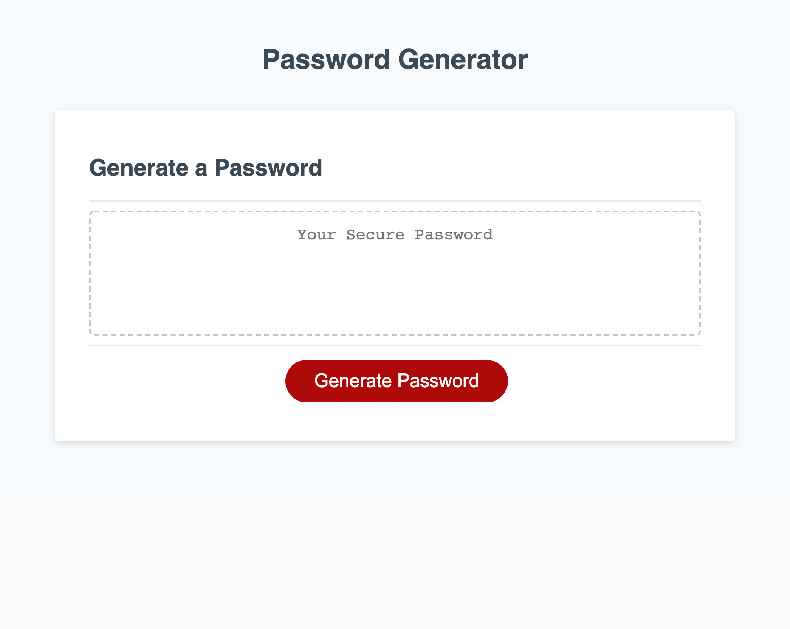

# Random-Password-Generator
A random password generated based on criteria from user prompt inputs. 
The prompts ask user for:
* Length of password between 8 and 128
* To include upper case characters?
* To include lower case characters?
* To include numbers?
* To include special characters?
Prompts after length input will not initiate until length of the password submitted by user is within the parameters.
If the user does not select at least one type of character, the user must reclick the generate button and start over.
Random password will post to the main box on the page when all the criteria is met and submitted.

# Summary of changes
* Initial commit
* Creating confirm variables
* Creating character arrays
* Prompting user for types of characters in password return
* Creating for loop for length of password
* Fixing bug in 4 negative options else if statement
* Creating while loop for invalid responses in confrimLengthPass variable/ prompt
* Cleaning up code
* Adding comments to js file
* Adding README.md
* Editing prompt messages

# Deployed Portfolio Website Image

# Link to Random Password Generator
https://haywah27.github.io/Random-Password-Generator/